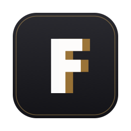

# F

Leica M (Typ 262) / Q3 の DNG に特化した爆速セレクトビューワー（macOS）。

RAW現像はしません。大量の撮影データから「残す1枚」を最速で選び、
結果をXMPサイドカーで Lightroom / Capture One に引き継ぐためのツールです。



## 特徴

- **キー送り、先読みヒット時のアプリ処理 0.1ms**（テクスチャ先読み+LRUキャッシュ2GB）
- 機種別の最適経路: Q3=埋め込み原寸JPEG抽出 / M262=自前LJ92デコーダ+ハーフサイズ縮約
- LJ92（lossless JPEG）デコーダはlibrawと全画素一致を検証済み
- 100%等倍（フルデモザイクは等倍要求時のみ遅延実行）
- レート/除外/カラーラベル/キーワードを **XMPサイドカー**（Lightroom/C1互換）に書き出し。
  元のDNGには一切書き込まない
- サムネグリッド、フィルター、SDカード自動検出（DCIM再帰検索）
- **JPGも表示**: DNGのみ / JPGのみ / 両方をツールバーで切替（選択は保存）。
  同名のDNG+JPGペアは同一ショットとしてレート/ラベル/キーワードを共有
- セレクト結果の**書き出し**（⌘E）: 表示中/レート/ラベル/キーワードで絞って
  DNG+XMPを別フォルダへコピー。除外(✕)の一括ゴミ箱移動も

## キー操作

| キー | 動作 |
|---|---|
| ⌘O | フォルダ/SDカードを開く |
| ← → ↑ ↓ | 送り / グリッド選択移動 |
| Enter / Space | グリッドから開く / 等倍トグル |
| Z | 100%ピクセル等倍（ドラッグでパン） |
| G / Esc | グリッド ⇔ 1枚表示 |
| 1-5 / 0 / X | レート / クリア / 除外 |
| 6-9 | カラーラベル（赤/黄/緑/青、LR互換） |
| T | キーワード（任意名タグ）編集 |
| I | 撮影情報（SS/F値/ISO/レンズ等）の表示切替 |
| F | フィルムストリップの表示切替 |
| ⌘+ / ⌘− | サムネイルサイズ |
| ⌘E | 書き出し（別フォルダへコピー） |

## 動作環境

- macOS 26 (Tahoe) 以降を推奨（Liquid Glass UI。macOS 15はフォールバック表示）
- Apple Silicon

## インストール

[Releases](../../releases) から `F-x.y.z.dmg` をダウンロードして `F.app` を Applications へドラッグするだけ。

Apple公証（notarization）済みなので、ダブルクリックで警告なく起動します。

## 開発

```
# パッケージのテスト
for pkg in DNGKit DecodeKit CacheKit XMPKit; do
  swift test --package-path Packages/$pkg
done

# アプリのビルド（Xcode 26+）
xcodebuild -project F.xcodeproj -scheme F -configuration Release build
```

アーキテクチャ: `App → CacheKit / XMPKit → DecodeKit → DNGKit`（一方向依存）。
詳細は `docs/dng-analysis.md`（DNG実態調査）と `docs/performance.md`（性能計測）を参照。

実機DNGフィクスチャ（`samples/`、git管理外）が無い環境では該当テストは自動スキップされます。
